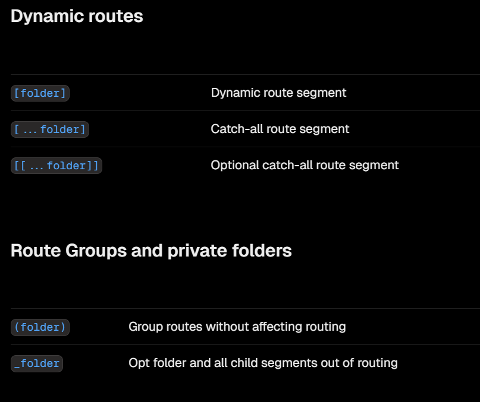
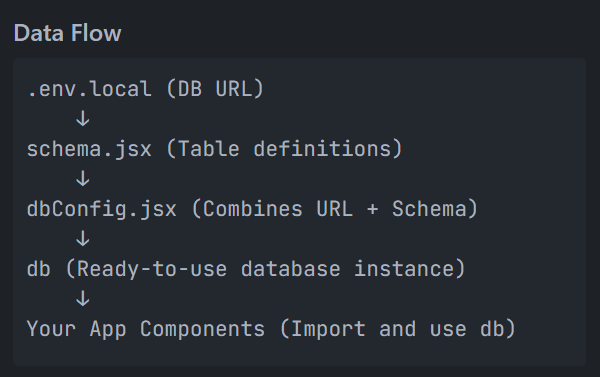

This is a [Next.js](https://nextjs.org) project bootstrapped with [`create-next-app`](https://github.com/vercel/next.js/tree/canary/packages/create-next-app).

## Getting Started

First, run the development server:

```bash
npm run dev
# or
yarn dev
# or
pnpm dev
# or
bun dev
```

Open [http://localhost:3000](http://localhost:3000) with your browser to see the result.

You can start editing the page by modifying `app/page.js`. The page auto-updates as you edit the file.

This project uses [`next/font`](https://nextjs.org/docs/app/building-your-application/optimizing/fonts) to automatically optimize and load [Geist](https://vercel.com/font), a new font family for Vercel.

## Learn More

To learn more about Next.js, take a look at the following resources:

- [Next.js Documentation](https://nextjs.org/docs) - learn about Next.js features and API.
- [Learn Next.js](https://nextjs.org/learn) - an interactive Next.js tutorial.

You can check out [the Next.js GitHub repository](https://github.com/vercel/next.js) - your feedback and contributions are welcome!

## Deploy on Vercel

The easiest way to deploy your Next.js app is to use the [Vercel Platform](https://vercel.com/new?utm_medium=default-template&filter=next.js&utm_source=create-next-app&utm_campaign=create-next-app-readme) from the creators of Next.js.

Check out our [Next.js deployment documentation](https://nextjs.org/docs/app/building-your-application/deploying) for more details.


## Learning from the project

- Set up next.js
- use shadcn ui for components like button etc.
- You can set the fonts of your by changing the font in layout.js using google fonts
- dashboard is route folder, but _dashboard is not a route folder.
- use hyper ui for banner(landing page), auth form(not available)
- Folder Structure in Next.js ---> 
    
- for database use drizzle orm with neon database. the steps are ---> 
    
- inside useEffect --> no array given- runs infinite times
                        empty array -  runs once at the starting
                        with variable - runs when the variable changes
- next.js has useRoute and usePathname to do operations on route and get pathname respectively.
- we use params (as prop) to get the data from pathname(e.g.: budgets/34)
- to use clerk auth, you have to use middleware.ts(catch-all route segment by (.*)), signIn, signUp pages (catch-all route segment).
- also you have to set the public routes(in the middleware.ts) and environment variables(in .env file)

## Set-up step by step

- first make header component
- hero component
- clerk authentication
- side nav bar
- database setup
- set new budget dialog using shadcn
- update budget list using useEffect
- add skeleton effect(animate-pulse)
- 